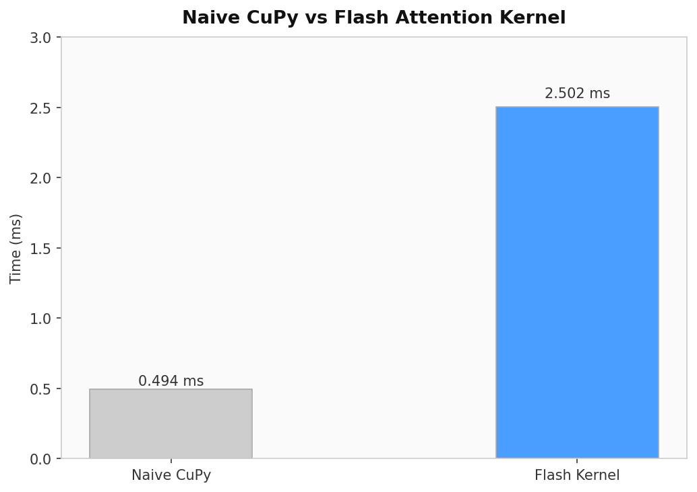

# Flash Attention from Scratch in CUDA / CuPy

A from-scratch implementation of Flash Attention using a custom CUDA kernel written in CuPy RawKernel. Built to understand the algorithm deeply — online softmax, tiling, O(N) memory — and verify it against naive attention.

The kernel is mathematically correct. It does not beat naive CuPy attention in performance. That gap comes from score parallelization, a known hard problem that requires warp-level reductions and shared memory score caching. That is the next step.

---

## What is Flash Attention

Standard attention computes the full NxN score matrix and writes it to global memory (HBM). matrix is large and the repeated HBM reads and writes become the bottleneck.

Flash Attention processes attention in tiles. The score matrix is never materialized in HBM — scores are computed tile by tile, kept in registers, and discarded. Memory complexity goes from O(N²) to O(N).

The key insight is online softmax — an algorithm that computes exact softmax incrementally without seeing all scores at once, using a running maximum and running sum that get corrected each tile.

---

## Algorithm

Outer loop — iterate over tiles of Q

Inner loop — for each Q tile, iterate over all K and V tiles

For each tile:
- Compute score tile S = Q_tile @ K_tile.T / sqrt(d) in registers
- Update running max m and running sum l using online softmax
- Apply correction factor exp(m_old - m_new) to rescale prior accumulation
- Accumulate output O += exp(S - m_new) @ V_tile

After all tiles — divide O by l to normalize, write to HBM once

The NxN score matrix never exists in memory. Only tiles live in SRAM at any moment.

---

## Results

Tested on RTX 3050 (4GB), N=512, d=32, float32.



The kernel is correct. Naive CuPy is faster because it uses cuBLAS under the hood — highly optimized hand-tuned assembly. Matching cuBLAS performance requires proper score parallelization across threads using shared memory, which is not implemented here.

---

## Project Structure

```
flash-attention/
├── naive.py        # standard attention in pure CuPy ops
├── flash.py        # Flash Attention RawKernel implementation
├── benchmark.py    # CUDA event timing
├── plot.py         # bar plot visualization
├── main.py         # entry point
└── README.md
```

---

## Setup

```bash
pip install cupy-cuda12x matplotlib
```

Requires CUDA 12.x and a compatible NVIDIA GPU.

---

## Run

```bash
python main.py
```

Runs correctness check, prints timing comparison, saves plot to `flash_results.png`.

---

you can compute exact softmax without storing all scores by maintaining a running max and sum with a correction factor applied each tile.

The performance gap between a correct custom kernel and cuBLAS is large. Closing that gap requires warp-level parallelism, shared memory score caching, and careful thread coordination.
